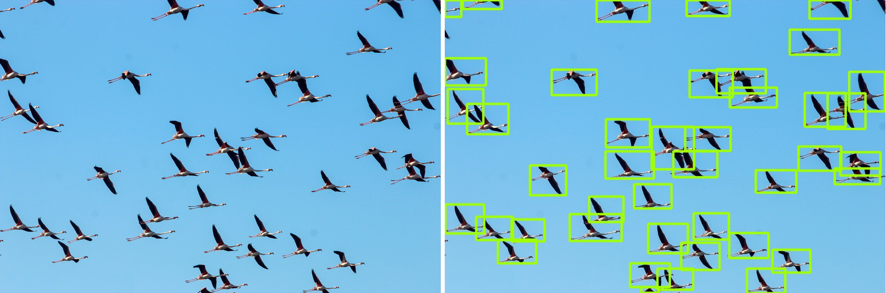

# Migratory bird Label/Train/Detection

## **目的**
### 日常生活中，我們常常會對『數量』有著些許的好奇，比如跨年人潮、車流量，或是生態中的動物數量，比如空中的飛鳥、地上的螞蟻、顯微鏡中的細菌病毒 等等；以往這些都是要找個人去慢慢的數數，既耗工又費時，著實吃力不討好。但是，自從機器學習的物件偵測能力越發強大，尤其新出版的 Yolov4/v5 (註1,2) ，更是讓這方面的需求達到了讓人滿意的結果。下面簡單介紹一下如何「從零開始」 讓電腦學會如何偵測物件。

## 資料集(dataset)
### 這邊以最簡單的空中飛鳥當作範例。首先，先上網收集一些簡單容易手工製作標記(Label)的飛鳥圖片， 因為人力有限，所以這邊只有收集約200張圖片做訓練用，越困難越複雜的偵測題目則需要更大量的圖片作為機器學習之用。

### 接下來要把 飛鳥 的位置給標記出來讓機器去學習。以物件偵測來說，需要提供物件邊界框(bounding box)的相關座標。推薦使用一套簡單使用的標記軟體: Labelimg (附1)。

### 使用labelimg對飛鳥圖片做標記後，會自動產生 xml 檔案，裡面最主要會記錄物件邊界框(bndbox)的左上角座標(xmin,ymin)與右下角座標(xmax,ymax)，使用的是 像素(pixel)座標。

### Yolo 吃的格式是依據圖片寬高去做正規化(normalize)的 「邊界框中心座標」以及 「邊界框的寬與高」。簡單來說，Yolo定義的每個邊界框需要 x,y,w,h 四個值，可以由 xml 中邊界框的 左上、右下座標做轉換:
* center_x = (xmin + ymin) / 2 / image_width
* center_y = (ymin + ymax) / 2 / image_height
* box_width = (xmax - xmin) / image_width
* box_height = (ymax - ymin) / image_height

## 參考資料
* Yolov4: https://github.com/WongKinYiu/PyTorch_YOLOv4
* Yolov5: https://github.com/ultralytics/yolov5
* Labelimg: https://github.com/tzutalin/labelImg
