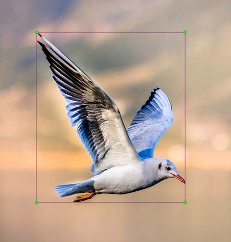
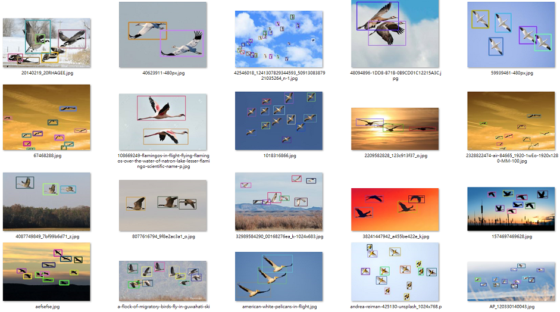
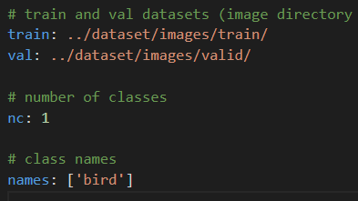
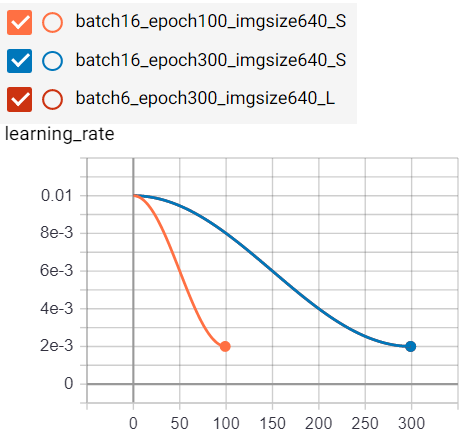
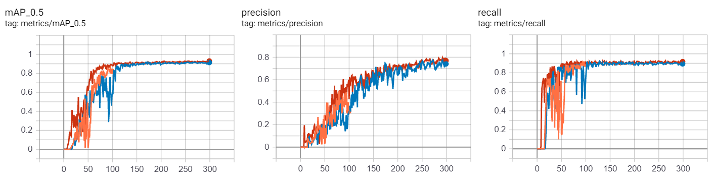
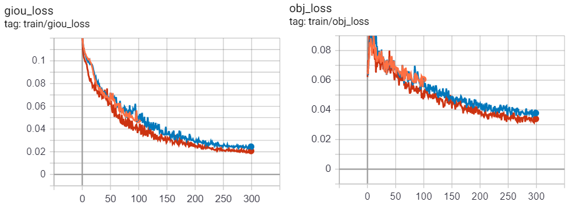
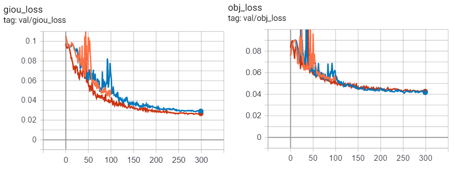
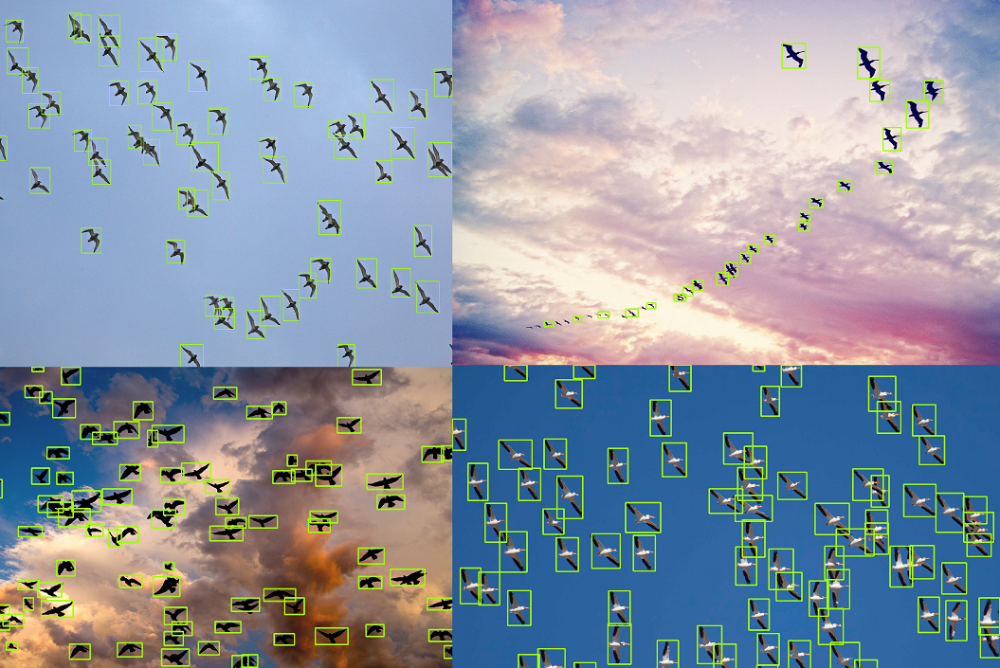

# 從頭開始作候鳥的標記/訓練/偵測 (by Yolov4)
# Migratory Birds label/train/detect from scratch by Yolov4

## **目的**
### 日常生活中，我們常常會對『數量』有著些許的好奇，比如跨年人潮、車流量，或是生態中的動物數量，比如空中的飛鳥、地上的螞蟻、顯微鏡中的細菌病毒 等等；以往這些都是要找個人去慢慢的數數，既耗工又費時，著實吃力不討好。但是，自從機器學習的物件偵測能力越發強大，尤其新出版的 Yolov4/v5 (註) ，更是讓這方面的需求達到了讓人相當滿意的結果。下面簡單介紹一下如何「從零開始」 讓電腦學會如何偵測物件。

## 資料集(dataset)
### 這邊以最簡單的候鳥(migratory birds)當作範例。首先，先上網收集一些簡單容易手工製作標記(Label)的飛鳥圖片， 因為人力有限，所以這邊只有收集約200張圖片做訓練用，越困難越複雜的偵測題目則需要更大量的圖片作為機器學習之用。

### 接下來要把 飛鳥 的位置給標記出來讓機器去學習。以物件偵測來說，需要提供物件邊界框(bounding box)的相關座標。推薦使用一套簡單使用的標記軟體: Labelimg (註)。

### 使用labelimg對飛鳥圖片做標記後，會自動產生 xml 檔案，裡面最主要會記錄物件邊界框(bndbox)的左上角座標(xmin,ymin)與右下角座標(xmax,ymax)，使用的是 像素(pixel)座標。

### Yolo 吃的格式是依據圖片寬高去做正規化(normalize)的 「邊界框中心座標」以及 「邊界框的寬與高」。簡單來說，Yolo定義的每個邊界框需要 x,y,w,h 四個值，可以由labelimg產生出來的 xml 中邊界框的 左上、右下座標做轉換:
* center_x = (xmax + xmin) / 2 / image_width
* center_y = (ymax + ymin) / 2 / image_height
* box_width = (xmax - xmin) / image_width
* box_height = (ymax - ymin) / image_height
### 標記完成的圖片就可以餵給Yolo當訓練囉!

## 訓練(Training)
### 這邊使用的是 Yolov4 作為物件偵測的機器學習套件，把準備好的圖片放入資料夾中，並且以 80/20 比例分成 訓練集(train)與驗證集(valid)，就可以開始使用 Yolo 來訓練。首先修改一下 data/coco.yaml，指定好圖片放置位置路徑，並將類別數量(nc) 改成 nc:1 以及名稱改成  name: ['bird'] (只有鳥類一種分類)，

### 把檔案全部上傳到google drive後就可以接著在google colab做一些簡單訓練 (GPU: Nvidia P100)

## 訓練結果
### 這邊做了幾個不同的參數設定來測試效果: 
### (model_4s, 100 epochs vs. 300 epochs) 與 (300 epochs, model_4s vs. model_4l)
###### python train.py --cfg 'models/yolov4s-mish.yaml' --data data/coco.yaml' --img 640 --batch 16 --epochs 100
###### python train.py --cfg 'models/yolov4s-mish.yaml' --data data/coco.yaml' --img 640 --batch 16 --epochs 300
###### python train.py --cfg 'models/yolov4l-mish.yaml' --data data/coco.yaml' --img 640 --batch 6 --epochs 300

* Learning Rate:  

* mAP / Precision / Recall

* Train Loss

* Valid Loss

### 由實驗結果可知，因為測試圖片相對比較簡單，所以準確度可以收斂到很高以及損失很低，但是訓練時間拉長以及大模型(L)較能獲得更佳的結果。所以後續就以大模型(L)與長時間訓練(300 epochs)的結果當作測試。

## 高壓測試
### 前面訓練的都是簡單的圖片，這邊用一些更複雜的圖片來測試看看效果。

### 這幾張圖已經是比訓練圖集還要更加複雜，但是測試結果仍然十分驚人的準確，除了少許小物件與重疊物件辨識度較低落，但是整體效果相當優異。

## 增加複雜圖片資料集
### 一般做物件偵測的訓練上，資料集(dataset)大部分都是成千上萬甚至幾百萬，但是以一般人力有限的情況下，光是使用labelimg作標註幾百張圖片都需要一兩天的工作時間，更何況是幾萬幾百萬張。這時候就是階層式訓練法發揮優勢的地方了，先由人工標註的幾百張圖片，訓練出一個最基本的物件偵測模型。再利用這個模型作複雜圖片邊界框(bounding box)的標記，就可以餵給labelimg作小修正或是補上缺失，就可以快速的將複雜圖片做好邊界框的標記並加入資料集中；然後再次訓練模型，然後再次預測並再次加入更複雜圖片，以此類推。
### 下面則是將複雜圖片由模型預測出邊界框之後，再由labelimg作修正之後再合併入原來的簡單資料集中，讓訓練與驗證資料集更加豐富且更複雜，並讓模型從中學習更佳結果後最新的預測結果:

### 可以看的出來加上複雜資料集所訓練出來的新模型比原先的更加精準，模型也更有能力去偵測小物件與重疊物件。

## 影片測試
### 以屏東滿州的鵟鷹影片做為測試，作為生態觀測來說，模型偵測結果應該算是相當不錯!

## 參考資料
* Yolov4: https://github.com/WongKinYiu/PyTorch_YOLOv4
* Yolov5: https://github.com/ultralytics/yolov5
* Labelimg: https://github.com/tzutalin/labelImg
